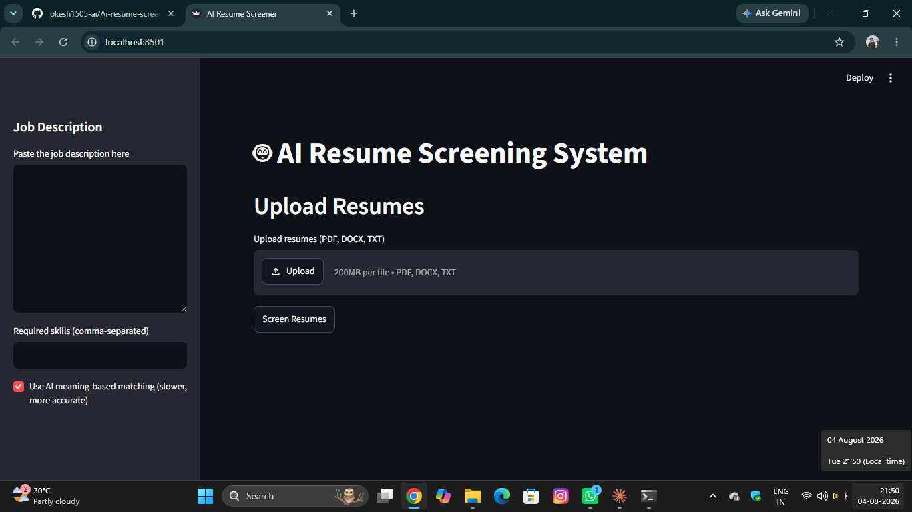
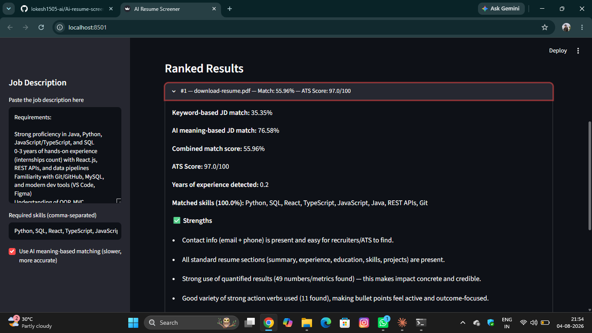
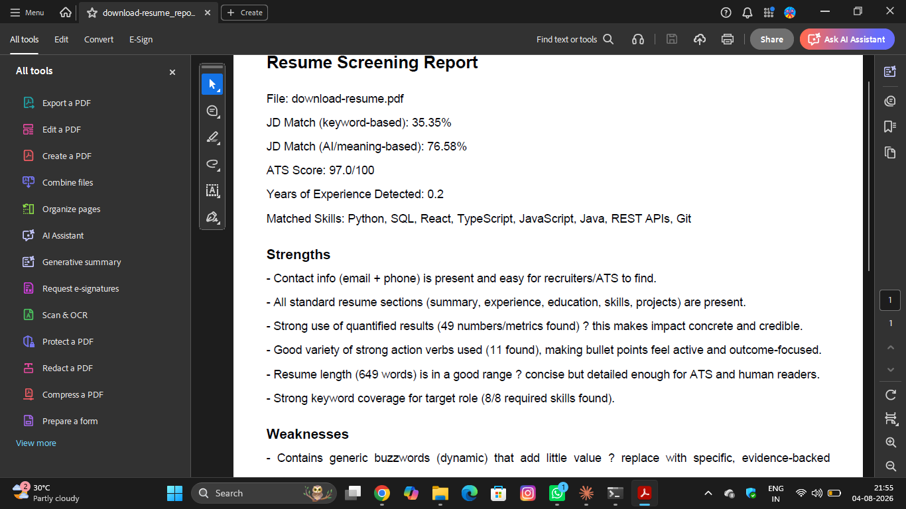

## 🌐 Live Demo

🚀 **Live App:** https://ai-resume-screener-n6g3qty9vyytremdqjqpx4a.streamlit.app


# 🤖 AI Resume Screener

An AI-powered resume screening application that evaluates resumes against job descriptions using Natural Language Processing (NLP), semantic similarity, and ATS scoring techniques.

## ✨ Features

- 📄 Upload Resume (PDF)
- 🎯 ATS Score Analysis
- 🧠 Semantic Matching
- 💼 Skill Extraction
- 📊 Experience Analysis
- 📑 PDF Report Generation
- ⚡ Simple Streamlit Interface

## 🛠️ Tech Stack

- Python
- Streamlit
- Scikit-learn
- TF-IDF
- Cosine Similarity
- NLP
- PDF Processing

## 📂 Project Structure

```
AI-resume-screener/
├── app.py
├── ats_analyzer.py
├── parser.py
├── experience_parser.py
├── semantic_matcher.py
├── report_generator.py
├── screener.py


## 🚀 Installation

1. Clone the repository

```bash
git clone https://github.com/lokesh1505-ai/AI-resume-screener.git
```

2. Navigate to the project

```bash
cd AI-resume-screener
```

3. Install dependencies

```bash
pip install -r requirements.txt
```

## ▶️ Usage

Run the application using:

```bash
streamlit run app.py
```

Open your browser and access the local Streamlit URL.

---

## 📸 Screenshots


### Home Page


### Results


### PDF Report


---

## 🎯 Future Improvements

- Support DOCX resumes
- AI interview question generation
- Resume improvement suggestions
- Multiple resume comparison
- Job recommendation system

---

## 👨‍💻 Author

**Lokesh Baskaran**

- 🎓 B.Tech Information Technology Graduate
- 🤖 AI Engineer | Software Developer
- 🌐 Portfolio: https://lokesh-portfolio-website.lovable.app
- 💼 LinkedIn: https://www.linkedin.com/in/lokesh-baskaran-7433b2278
- 📧 Email: lokeshbaskaran1505@gmail.com

---

⭐ If you found this project useful, consider giving it a Star!
├── requirements.txt
└── README.md
```
